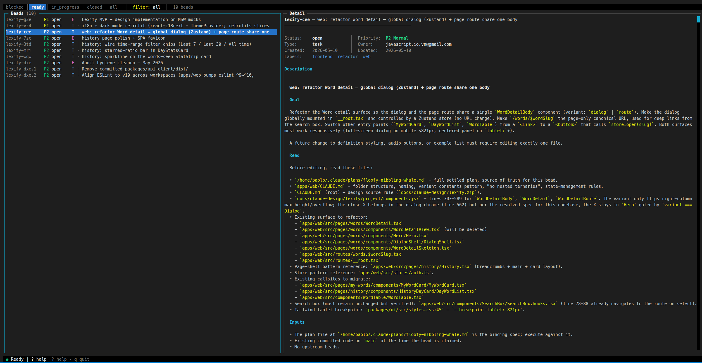

# bdtui

Fast blessed-based terminal UI for the [`bd`](https://github.com/gastownhall/beads) beads issue tracker.



## Requirements

- Node ≥ 20
- `bd` installed and on `$PATH`
- A project with a `.beads/` database (created by `bd init`)
- (Optional) A clipboard helper for the `y` yank key:
  - Linux/Wayland: `wl-clipboard` (`sudo apt install wl-clipboard`)
  - Linux/X11: `xclip` (`sudo apt install xclip`) or `xsel`
  - macOS: `pbcopy` (preinstalled)
  - Windows: `clip.exe` (preinstalled on Windows 10/11)

## Install

First install `bd`:

```bash
brew install beads          # macOS / Linux
npm install -g @beads/bd    # via Node.js
```

Then install bdtui:

```bash
npm install -g bdtui
```

## Usage

```bash
bdtui              # use current directory
bdtui .            # explicit current directory
bdtui ~/www/myapp  # explicit project path
```

## Layout

```
┌─[ready  open  in_progress  all]────────────────────────────┐
│ list (40%)            │ detail (60%)                        │
│ > be-12 P1 in_prog …  │ be-12 — Some bead title             │
│   be-13 P2 open    …  │ Status: in_progress  Priority: P1   │
│                       │ Type:   feature      Owner: —        │
│                       │ …                                   │
├───────────────────────┴─────────────────────────────────────┤
│ ● Ready  │  ? help · q quit                                 │
└─────────────────────────────────────────────────────────────┘
```

Beads with parent–child dependencies are shown as a tree inside the active filter:

```
be-10  P1 open    E    Epic title
be-11  P2 open    T  ├ Child task
be-12  P2 ready   T  └ Another child
```

## Keybindings

| Key | Action |
|-----|--------|
| `j` / `↓` | Move down |
| `k` / `↑` | Move up |
| `g` / `G` | Jump to top / bottom |
| `Enter` / `l` | Focus detail pane |
| `h` / `Esc` | Back to list |
| `f` | Cycle filter: ready → open → in_progress → all |
| `r` | Reload current filter |
| `/` | In-memory title filter |
| `s` | Change status |
| `c` | Close with reason |
| `C` | Claim (in_progress + assign self) |
| `o` | Reopen |
| `p` | Change priority |
| `D` | Dependency menu (add / remove) |
| `y` | Yank bead ID to clipboard |
| `w` | Pick a workflow skill (`/executor-task`, `/executor-task-worktree`, `/executor-epic-task`, `/executor-epic-task-worktree`) and copy it with the selected task's ID. Disabled for epics. See [workflow-template](https://github.com/jsiovn/workflow-template). |
| `?` | Help overlay |
| `q` / `Ctrl-C` | Quit |

## Author

[JSIOVN](https://github.com/jsiovn)

## License

MIT
